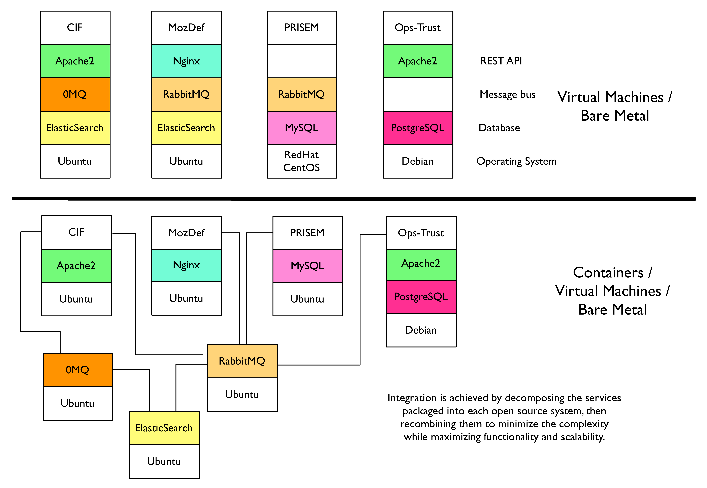
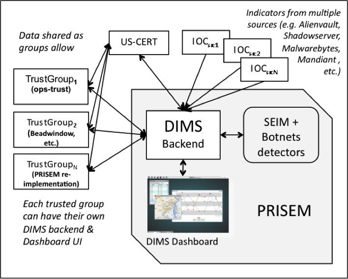
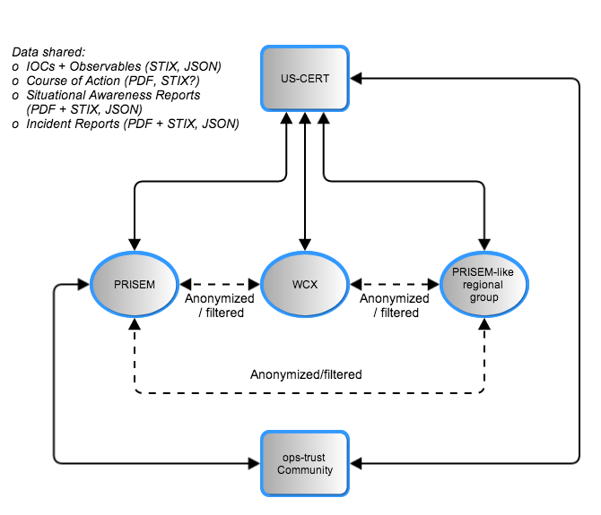

.. _newsystem:

Concept for a new or modified system
====================================

.. _backgroundobjectivesscope:

Background, objectives, and scope
---------------------------------

One of the objectives of DIMS is to combine the best features of several
open source projects using a `framework` model that integrates
these components into a coherent whole. All of these systems were built
by groups independently of each other, often with volunteer effort, or
with limited budgets within corporations that chose to make these tools
available as open source to encourage use by the security community.

One of the primary challenges faced by the DIMS team will be to move beyond the
mindset of installing and configuring a small set of discrete open source
packages on a single workstation and using the tools like a normal security
operator. This mindset is limited in that it assumes stasis, or at least little
change or modification beyond that provided by regular patches or releases from
the open source author.

Producing a `framework` means using automated build processes, commonly known
today as `DevOps` (see `What is DevOps?`_) as a method of automating the
build+configure tasks faced by system administrators, and using `Continuous
Integration`_ as a method of managing the source code for programs and system
configuration, pushing those changes and compiled programs into running
systems.

.. _What is DevOps?: http://theagileadmin.com/what-is-devops/
.. _Continuous Integration: http://www.thoughtworks.com/continuous-integration

As much as possible, DIMS will be built through the (re)use of open source
components used by other projects that are being integrated into the DIMS
framework. For example, the `Collective Intelligence Framework`_ (CIF) v2 and
the Mozilla Defense Platform (`MozDef`_) both employ the `ELK stack`_ and
`RabbitMQ`_ in their demonstration implementations, and the original PRISEM
distributed data processing tools also used RabbitMQ. Rather than have two
separate instances of Elasticsearch running in virtual machines or containers
for MozDef and CIF, and two separate instances of RabbitMQ in virtual machines
or containers for PRISEM tools and MozDef, a common Elasticsearch cluster and
RabbitMQ cluster would be set up and shared with these and any other open
source tools that someone would want to add in later. (Another example of a
system made up of multiple components, packaged together into a single
easy-to-install package, is the `GRR Rapid Response`_ system.)

.. _Collective Intelligence Framework: http://code.google.com/p/collective-intelligence-framework/
.. _MozDef: http://mozdef.readthedocs.org/en/latest/
.. _ELK stack: http://www.elasticsearch.org/overview/
.. _RabbitMQ: http://www.rabbitmq.com/
.. _GRR Rapid Response: https://github.com/google/grr

Figure :ref:`recombination` illustrates the thinking behind this DevOps/CI
mindset, and how it can be applied to build DIMS. The upper half of
the figure represents (conceptually, not in precise technical terms) the way
that open source systems are commonly bundled together. From left to right are
the Collective Intelligence Framework described in Section :ref:`cif`,
`MozDef`_, some of the PRISEM system components described in Section
:ref:`prisemnow`, and the ops-trust portal described in Section
:ref:`opstrustportalnow`. From top to bottom in this conceptual model
are the common components of application user interface (in this case, a
RESTful HTTP/HTTPS interface), a message bus mechanism for inter-process
communication that can span computer systems, a database storage mechanism,
and a base operating system within which all of these components are installed.

.. _recombination:

   Recombination of open source systems

..

The bottom of the image depicts, again conceptually, how you would
rip apart or docompose the subsystems in these `packaged` deployments,
and turn them into discrete component services that are contained in
smaller units. By compartmentalizing services in this way, it may be
easier to integrate several open source packages that may have conflicting
requirements for base operating system type, operating system version,
libraries (and their versions), or configuration and tuning parameters for
shared services (like the PostgreSQL database). In the bottom of Figure
:ref:`recombination` one Elasticsearch cluster, and one RabbitMQ cluster,
can be implemented and shared by multiple components (rather than having
two seperate small clusters in two separate virtual machines or bare-metal
machines. This would allow linear expansion of these clustered services
as needed for growth. (It could even be possible to elminate one of the
two message bus systems, either RabbitMQ or ZeroMQ, to further simply the
architecture.)

.. _ZeroMQ: http://zeromq.org/

.. _oppoliciescontraints:

Operational policies and constraints
------------------------------------

.. _descriptionnewsystem:

Description of the new or modified system
-----------------------------------------

Figure :ref:`DimsSystemOverview` depicts a high-level diagram of the
system architecture for the DIMS system. DIMS provides a user
interface layer on the front end, as well as a data processing layer
on the back end, that integrates with two existing systems.

The first is the Security Information Event Management (SIEM) system
at the core of the PRISEM project, and the technologies associated
with it to perform behavioral detection of malicious activity from
network flow data and support forensic analysis of historic data to
respond and recover from attacks that evade detective mechanisms. This
system collects and processes security related events and network flow
data and supports a collective approach to responding and recovering
from security events.

.. _DimsSystemOverview:

   Overview of DIMS System

..

The second system is the Ops-Trust portal system, used by a community
of several hundred computer security professionals with operational
and research roles in industry, government, and academia. This system
is primarily designed to facilitate trust group maintenance and
communication to deal with emerging threats and events of
international scope.

The DIMS software will bring these two systems together into a
collaborative environment for shared analysis and shared response of
shared threats, both within a regional trust community, as well as
across multiple such trust communities in other regions. Through
vertical sharing of indicators of compromise from US-CERT to the
regional level, and lateral sharing across regional entities, the
objective is to scale actionable information sharing to state, local,
territorial, and tribal (:term:`SLTT`) government entities across the United
States, and extend the sharing to international trust groups who make
up the global fabric of the internet.

.. _DataFlowsBetweenStakeholders:

   Data Flows Between Stakeholders

..

Figure :ref:`DataFlowsBetweenStakeholders` depicts the data flows
between a subset of the stakeholders who will be using the DIMS
software system. The solid lines depict data that has the highest
degree of sensitivity and trust, often being transmitted in
un-redacted form (possibly tagged with TLP indicators for most
restricted sharing). The dashed lines depict data flows that are at
lower levels of trust, and may be transmitted only in redacted form
(possibly tagged with TLP indicators for the least restricted
sharing). The type of data shared may be structured IOC and
Observables in STIX format, Course of Action information in either PDF
or structured format, `Situational Awareness Report` (SITREP)
documents that describe observed campaign level activity at a high
level, possibly with structure data containing IOCs or Observables to
assist recipients in searching for related activity, and incident
reports that may similarly be a combination of human-readable PDF and
machine-readable IOCs/Observables. There are two types of data that
will be shared in most use cases: high-frequency, high-volume,
automated data feeds of `reputation` data and IOCs/Observables coming
from analytic and research groups; low-frequency, low-volume, manually
triggered bundles of IOCs/Observables, Course of Action information,
and/or high-level SITREPs for specific
incident-level up to campaign-level activity. The DIMS software,
layered on top of the Ops-Trust portal system, will facilitate
production of these reports and transmission/reception of structure
data files and facilitate automated processing of the structure data
files to pre-process data for an analyst to consume when ready, rather
than forcing the analyst to do a lot of work manipulating files,
processing their contents, and manually entering data into report
generation front ends in web based portals.

.. _newusers:

Users/Affected Personnel for New System
---------------------------------------

The full list of stakeholders and prospective users of the new
system includes:

#. *PRISEM participants*: Existing participants in the PRISEM project in the
   Puget Sound will be the primary users of the DIMS system. DIMS is being
   designed to provide them with advanced mechanisms for rapid response,
   situational awareness, and communication within the trusted group. Next
   highest priority is to provide structured data interchange between the
   existing Ops-Trust portal and the DIMS system, allowing lateral sharing of
   IOCs and observables between the existing Ops-Trust community members and
   PRISEM participants as allowed by policy (or with redaction and/or
   anonymization, as appropriate.) Some features added to the Ops-Trust portal
   by the DIMS project team will be integrated in such a manner that they are
   available to Ops-Trust members without having to use the DIMS front end
   software. Those users who are not part of the existing Ops-Trust community,
   or Ops-Trust members willing to learn a new interface, can use the DIMS
   front end and will have access to a larger set of features than are
   available via the normal Ops-Trust services.

#. *PRISEM Administrators and DIMS developers*: Related to the PRISEM
   membership is an entity being formed to administer the PRISEM model in the
   form of a not-for-profit organization responsible for daily operations,
   system administration, provisioning of SIEM collectors and SIEM
   configuration, training, etc. This entity is still being formulated and does
   not exist today (however it is likely to exist before the end of the option
   year for the DIMS project.) The DIMS developers will also serve as system
   administrators, trainers, and user support for the initial DIMS deployment
   while the PRISEM stand-alone entity is being stood up.

#. *US-CERT*: Provides IOCs in STIX format to PRISEM participants as part of an
   existing Cooperative Research and Development Agreement (CRADA) between
   US-CERT and the PRISEM project. 

#. *Ops-Trust*: This is a community of several hundred operational security
   professionals from the private sector, academia, etc. They currently share
   information in ad-hoc ways, primarily through email communications and IRC
   chat.

#. *NCFTA*: This is a federal government and industry collaborative
   organization primarily focused on computer crime related information sharing
   and analysis. They are located in Pittsburgh, Pennsylvania, but interact
   with corporate and government entities from a number of countries. NCFTA has
   complementary needs to those of the PRISEM participant base (though focused
   more on investigation than day-to-day monitoring). They are eager to take
   advantage of features provided by DIMS that support the investigator and
   analyst use cases. They have offered to compare requirements and use cases
   to their own needs, to help test new Ops-Trust and DIMS features, and
   provide feedback for test and evaluation of DIMS products.

#. *Western Cyber Exchange* (WCX): WCX is a non-profit entity located in
   Colorado Springs, Colorado, that integrates horizontally on a cross-sector
   and regional basis to allow for non-traditional information sharing between
   government and industry. They have expressed an interest in replicating the
   PRISEM model and in participating in DIMS software development and testing.
   Web site: wcyberx.org 

#. *True Digital Security*: True Digital provides network security assessments,
   vulnerability analysis, network security monitoring. They operate in the
   Tulsa, Oklahoma region. Like WCX, they have expressed an interest in
   replicating the PRISEM model and in participating in DIMS software
   development and testing. Web site: truedigitalsecurity.com

#. *United States Secret Service*: Federal law enforcement agency who would
   consume cybercriminal case information from victimized SLTT entities
   (such as the PRISEM user base an other similar stakeholder groups).
   They operate on a similar model to the UC1 and UC3 entities shown
   in Figure :ref:`stixusecases`, only focused on criminal investigative
   and national security situational awareness tasks and not security
   operations tasks like other federated groups like ISACs.

.. _support:

Support concept
---------------

Efforts are underway to create a non-profit, tax-exempt non-governmental
organization who is capable of engaging with SLTT government entities via
inter-local agreements. This entity will operate on a self-sustaining,
fee-based model that has been described by Parker Montgomery in his report,
"Organization Design: A Sustainable and Self-Sufficient Model for Washington
State’s PRISEM Partnership" (see :ref:`referenceddocs`).

The open source tools used to create DIMS, as well as the source code
and development infrastructure used to create DIMS, will all be released
to the public and will be deployable on modestly priced commodity hardware.
This makes for an affordable solution for SLTT government groups or other
organizations who wish to participate in trusted information sharing
in a scalable manner. There will be some ongoing costs associated with
maintaining and administering a DIMS deployment, but the goal is to
provide as much documentation as possible to keep the support costs
down.

.. note::

    A commercialization plan (which will include options for outsourced
    support) will be produced before the end of the period of performance for
    this contract.

..

