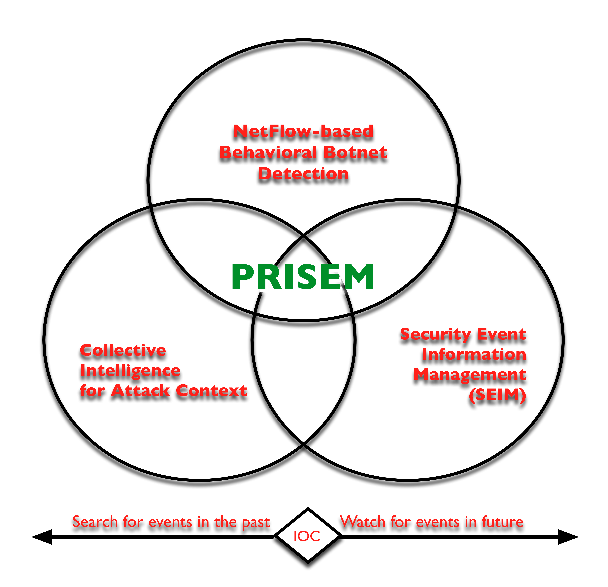

.. _currentsystem:

Current system or situation
===========================

Background, objectives, and scope
---------------------------------

Homeland Security Presidential Directive 7 (HSPD-7), [Exe03]_ released in 2003, set
in motion a number of policy changes and created awareness of a new problem --
the term for which is now ingrained into our lexicon: critical infrastructure
protection. That document specifies the actions to be taken to identify,
prioritize, and address the vulnerabilities to the systems and services that
have relevance to the American way and quality of life. Local (city and county)
government provides systems and services that maintain and improve the quality
of life at the scale at which citizens identify most directly. eGovernment
services allow citizens to pay bills, obtain a business license, communicate
with elected officials, etc. Local government arguably maintains 85% of
critical infrastructure, yet its protection is largely unaddressed. While the
rest of the world is focused on nation-state hackers versus Supervisory Control
and Data Acquisition (SCADA) systems or cardholder data breaches, local
governments with their silos, poor budgets and priorities that change with the
political wind are attempting to protect water purification, traffic
management, public safety communications and a great many other services -- the
loss of which would arguably have an impact including loss of life. Local
government is acknowledged in HSPD-7 as being integral to critical
infrastructure protection, however no reasonable effort has been made to
address cyber defenses on the local scale. Efforts to date to secure cyberspace
have called for a comprehensive system that protects federal government
agencies. A "comprehensive system" for securing the United States electronic
infrastructure that does not include local governments, however, is not truly
comprehensive.

Taking this all into consideration, two things become clear:

+ Critical infrastructure dependencies on local government must be addressed

+ Local governments need assistance with detective controls -- security
  monitoring -- and with response capabilities

Both these issues may be addressed by extending a concept that is common to
corporate IT organizations into the local government sector: managed security
service. Specifically, were a central location available for securely routing
activity logs, firewall and IDS alerts, and other forms of information
typically collected (but not analyzed) on networks, and then made available to
local governments as near real-time alerts and a portal for situational
awareness, the gaps between the criticality of the systems and services, and
the degree to which critical infrastructure elements are being protected can be
addressed.

The Public Regional Information Security Event Management (PRISEM) system was
designed to address gaps in capabilities between federal and local government
entities. PRISEM extends a concept common to corporate IT organizations –
managed security services – into the local government sector. It enhances
security oversight and controls and improves the ability to detect and respond
early to threats against critical infrastructure. It moves beyond basic
information sharing and creates an action-oriented alliance that leverages
limited expertise across resource-constrained local government IT
organizations. It creates a partnership between a top-tier research university,
federal law enforcement fusion center, and private sector organizations. Its
benefits will include increased security and compliance capabilities, increased
productivity, improved performance, and lower costs for participants.

.. _prisemcapabilities:

   PRISEM capabilities

..

The intent of the PRISEM system is to combine standard security devices event
log data using a commercial Security Information Event Management (SIEM)
system, fed in part by event log data from the DHS-funded NetFlow based  system
(formerly known as :term:`Einstein 1`), correlating these events using the SIEM to
detect structural bot activity that has a high probability of being an infected
computer. It uses the Collective Intelligence Framework (CIF) database system
to produce watchlists for real-time monitoring, as well as to provide
historical attack context. A geographic front end provides a regional context
to alerts in the system for at-a-glance situational awareness. The system now
allows indicators of compromise (IOCs) to be used for both finding events that
were missed in the past and/or watching for new events in the future. This
is depicted in Figure :ref:`prisemcapabilities`.

The primary mission of the PRISEM system is threefold:

+ To **enhance the information security capabilities** of local government and
  address exposures to critical infrastructure, systems and services without
  significantly raising cost, by providing the means to obtain visibility into
  attacks against information technology resources;

+ To **provide a method for reporting** cyber-security event or trend information
  in a consistent and automated fashion, for further evaluation by intelligence
  or law-enforcement communities in a manner that is respectful of national and
  international standards of individual privacy; and

+ To **create an action-oriented operational setting** for the deployment of
  research-grade technologies that were funded by the federal government, in
  order to evaluate their effectiveness and assist with their transition into
  commercial products.

In 2008 The Federal Emergency Mangement Agency, part of DHS, released the
National Response Framework. [Fed08]_ The relationship building between
hometown security and Homeland security began to form an enduring partnership.
As part of its commitment to hometown security, "DHS has worked to get tools,
information, and resources out of Washington, D.C. and into the hands of our
federal, state, local, tribal and territorial law enforcement partners."
[Dep13]_ The PRISEM project, initiated this same year, is an example of this
effort to bring these resources to the SLTT government level. It has served
this purpose, but to date only in the Puget Sound region.

Fast forward to February 2013. The President of the United States issues two
new policies:

#. Executive Order 13636: Improving Critical Infrastructure Cybersecurity [Exe13a]_ and
#. Presidential Policy Directive 21: Critical Infrastructure Security and Resilience. [Exe13b]_

These two documents (known as *EO 13636* and *PPD 21*) reflect the
acknowledgement that:

+ America's national security and economic prosperity are dependent upon the
  operation of critical infrastructure that is increasingly at risk to the
  effects of cyber attacks.

+ The vast majority of U.S. critical infrastructure is owned and operated by
  the private sector and/or State, Local, Territorial, and Tribal (SLTT)
  government entities, not by the federal government.

+ A strong partnership between the public and private sector, as well as
  between SLTT government entities in regions of the country, is crucial in
  reducing the risk to these vital systems.

.. _operationalpca:

Operational policies and constraints
------------------------------------

.. _policies:

Policies
~~~~~~~~

+ EO 13636 and PPD 21 provide guidance on how the federal government will work
  with private sector operators of critical infrastructure systems in order "to
  prepare for, prevent, mitigate, and respond to threats."

+ Policies for each of the SLTT government and private sector entities
  participating in the PRISEM system, and the PRISEM participant agreement,
  have privacy impacts when sharing information outside the project.

.. _assumptions:

Assumptions
~~~~~~~~~~~

+ It is assumed that the Ops-Trust portal system will be easy enough to
  refactor to accommodate the required API for user interface enhancements that
  underlie the DIMS front-end.

+ In addition, a successful application penetration test result (and
  remediation of critical security flaws that these tests may uncover) is a
  pre-requisite for the Ops-Trust stewards to allow the code to be released to
  the general public.

+ It is assumed that the open source tools necessary to provide the
  full set of capabilities described here and in the DIMS
  :ref:`dimssr:dimssystemrequirements` document, can be assembled in
  such a manner that they provide the necessary features in a coherent
  and integrated a manner.

+ We assume that the stakeholders who have expressed an interest in providing
  requirements and beta-testing feedback will follow through. It will be
  important to have at least two groups (beyond the Ops-Trust community and
  US-CERT) perform some "live-fire" structured information sharing experiments
  in order to fully exercise the data sharing aspects of DIMS. It is hoped that
  an organization like NCFTA, who is already familiar with the Ops-Trust portal
  system, can facilitate development and testing of the specific information
  sharing features that are part of their daily business processes.

.. _constraints:

Constraints
~~~~~~~~~~~

+ Data currently held in the PRISEM system cannot be shared with non-PRISEM
  members without the express permission of those whose data is held in the
  system. The DIMS team is operating under an NDA with the City of Seattle for
  access to `the City's data` in the PRISEM system for development purposes.
  Anonymization features described in this document are intended to facilitate
  sharing within these policy constraints.

+ The DIMS team is operating under an NDA with the Ops-Trust organization for
  access to the source code for their portal. Ops-Trust has released the source
  for the portal on GitHub (https://github.com/ops-trust/portal.git). Other
  information not made public yet cannot be released without their permission.

+ The DIMS team is operating under export control restrictions that apply to
  any/all encryption software used in the system. Based on consultation with UW
  Export Control authorities, the DIMS team will design the system such that it
  can be released as open source without encryption software included (but will
  list its pre-requisite status, where it can be obtained, and how it can be
  installed by the end user), or will deliver pre-installed/configured versions
  of the system only under export control restricting agreements negotiated by
  the appropriate authorities at the UW.

Description of current system or situation
------------------------------------------

There are gaps in functionality in the existing sub-systems that DIMS is
intended to address. The three primary sub-systems are: (1) the Ops-Trust
portal; (2) The Collective Intelligence Framework (CIF) database; and (3) the
PRISEM system. Each of these will be examined in turn.

.. _opstrustportalnow:

Ops-Trust portal Code Base
~~~~~~~~~~~~~~~~~~~~~~~~~~

+ Handles adding users by nomination + vouching workflow processing
+ Segregates trust groups (public or hidden) per administrator defined policy
+ Facilitates encrypted communication via email, and out-of-band contact via phone, IM, etc.
+ Provides a secure wiki for holding information contributed by users and other group knowledge
+ Holds attributes about users:

    + Name, nick-name (handle) to identify them in wiki
    + Telephone number for out-of-band communication
    + Closest airport to facilitate meeting in person when on the road
    + PGP (or GPG) encryption key
    + Instant messaging system username

.. What can the ops-trust portal do now?

The Ops-Trust portal currently does a good job of the nomination and vouching
workflow that allows user accounts to be set up and attributes populated. It
then does a good job of segregating trust groups from each other, including
facilitating encrypted email communications and storing data in a wiki.

.. What is lacking from the ops-trust portal at present?

There are several weaknesses or limitations to the way the Ops-Trust portal
works and is used. All IOC data is passed around at present is in arbitrary
forms (ASCII text columnar data in random field orderings, CSV files, PDF
files, etc.) and may be in the body of an email, as a MIME attachment, or in a
file specified by a URL in the body of the message. Often long lines of
columnar data get wrapped and are difficult to read or parse with scripts.
Cutting/pasting into security systems is difficult, if not impossible when
thousands of lines of data are included in some random field in a large
columnar list. Traffic Light Protocol (TLP)  tagging is done in random ways (if
done at all), and TLP tags in the body of a message do not get included when an
attached file is saved to disk. The subject line of emails includes the list
and it, and the list trailer at the bottom of the email, must be manually
scrubbed when forwarding a message off-list. Users must read every message in a
thread in order to keep up on new data that may involve hosts or networks that
the reader is responsible for protecting, and widespread and rapidly
progressing events can generate dozens or even hundreds of messages in a day,
which is difficult to keep up with.

.. _cif:

Collective Intelligence Framework (CIF) Database
~~~~~~~~~~~~~~~~~~~~~~~~~~~~~~~~~~~~~~~~~~~~~~~~

+ "Indicators of Compromise"
+ Hashes of malicious software
+ IP addresses, CIDR network address blocks, and DNS domain names associated with malicious activity (e.g., from sandboxes)
+ Builds context about attacker activity over time
+ Produces feeds of indicators for watchlists, searching hard drives, rules for security devices, etc.

.. What can CIF do now?

CIF provides a database of historic IOCs obtained from feeds that it consumes
on a regular basis. In turn, CIF produces feeds of IOCs that can be used for
watchlists, access control lists, IPS rules, etc. The PRISEM system uses CIF to
produce watchlists that are used by the Python based :term:`Botnets System` detectors
processing real-time NetFlow V5 records sent from network devices for real-time
detection of suspect flows. CIF correlates data in its tables, associating IOCs
from multiple sources, as well as enriching the data by looking up ASNs, domain
name to IP address associations, etc. Users can enter IOC data using CIF’s
browser plug-in, the CIFglue application from Verizon, or through the CIF API.

The PRISEM system also processes "SEARCH" records that are added to CIF when
someone searches, putting those IP addresses or CIDR blocks that are searched
for, but produce no results, into a watchlist. A more accurate way to do this
is to have users explicitly put suspicious IP addresses or CIDR blocks into CIF
with special tagging that is then used to generate a watchlist.

.. What is lacking from CIF at present?

While not a lack of features in CIF, per se, the way CIF is being used is
lacking in potential. While the PRISEM uses CIF to generate watchlists for
real-time network flow detectors, and creates a special watchlist for "SEARCH"
records as described above to watch for highly suspicious events, PRISEM users
(and the vendor portal) are not taking advantage of the full power of
watchlists because users must know how to manually enter data using one of the
secondary CIF-specific mechanisms listed above as the vendor portal does not
currently provide this ability.

CIF is also not being used to store security event information related to
alerts that are positively identified by analysts as being true-positive
indicators of compromise (or confirmation of IOCs sent to the system or entered
manually by analysts.) Were these events to be stored, they would be correlated
with other IOCs and could be published as a feed to interested outside parties.

.. _prisemnow:

The PRISEM System
~~~~~~~~~~~~~~~~~

+ Event collection, correlation, archiving
+ Distillation of hundreds of alerts per day from (low) tens of millions of events per day
+ Integrates the NetFlow :term:`Botnets System` behavioral detection capability
+ Requires intensive administration and coding when provisioning new tenants
+ Proprietary vendor portal the principal user interface

.. What can PRISEM do now?

The PRISEM system has demonstrated that sharing event logs within a trust
community improves the situational awareness across regional SLTT government
entities, that collaborative response improves everyone's capacity to respond
and recover, and that situational awareness reports being fed back to the
federal government through participation in Fusion Center activities. There are
as many as five regional SLTT collaboration efforts that the PRISEM leadership
has interacted with and who have expressed an interest in replicating what has
been done within PRISEM (see Section :ref:`newusers`).

.. What is lacking from PRISEM at present?

There are limitations in what PRISEM is capable of doing, primarily based on
the commercial off the shelf SIEM system at its core, and the reliance on a
proprietary vendor portal for the user interface that PRISEM participants use
on a daily basis. There is no flexible and secure real-time communication
vehicle that PRISEM participants use on a regular basis, and interaction among
PRISEM participants and analyst resources could be much higher. Also related to
the use of the vendor portal is a limitation on the visualization and analytic
capabilities. The portal only supports what the vendor has programmed it to
support. There is no easy way to integrate newly developed features,
visualization tools, or analytic algorithms that operate on the PRISEM
datasets.

.. _involvedpersonnel:

Users/Involved personnel for Current System
-------------------------------------------

The current PRISEM system has the following sets of users and
involved personnel:

+ Participating sites are mostly contributors of event log data,
  and consumers of alerts and reports. They receive notification
  from either a managed security service vendor's Security Operations
  Center (SOC) staff, or from the primary analyst working out of
  the Seattle Fusion Center.

  Select participants in the existing PRISEM system will be involved
  in requirement collection, test and evaluation, and will be the
  initial users of a DIMS deployment.

+ The current PRISEM principal analyst who interacts with the Seattle
  Fusion Center will contribute to requirements (primarily in the form
  of user stories), and will assist with test and evaluation of DIMS.

+ A research scientist at the University of Washington (also the PI
  on this contract), who helped design and test capabilities in the
  original PRISEM system, will contribute technical architectural
  design, requirement definition, test and evaluation, documentation,
  and initial user training on the DIMS system.

.. _supportconcept:

Support concept
---------------

.. How is PRISEM supported now?

The current PRISEM system has been supported through grant funding, support for
hosting hardware by entities at the University of Washington, and contracting
with a commercial managed security service vendor with working experience with
the underlying commercial SIEM system originally chosen for use by PRISEM.
This system is known as `Log Matrix` and is an end-of-life product now owned by
Intel subsequent to their acquisition of McAfee.

.. [Exe03] Executive Office of the President. Homeland Security Presidential Directive 7: Critical Infrastructure Identification, Prioritization, and Protection. http://www.dhs.gov/xabout/laws/gc_1214597989952.shtm, December 2003.
.. [Fed08] Federal Emergency Management Agency. National Response Framework. http://www.fema.gov/pdf/emergency/nrf/nrf-core.pdf, January 2008.
.. [Dep13] Department of Homeland Security. Strengthening the Security and Resilience of the Nation's Critical Infrastructure. http://www.dhs.gov/strengthening-security-and-resilience-nation's-critical-infrastructure, August 2013.
.. [Exe13a] Executive Office of the President. Executive Order No. 13636. http://www.fas.org/irp/offdocs/eo/eo-13636.pdf, February 2013.
.. [Exe13b] Executive Office of the President. Presidential Policy Directive – Critical Infrastructure Security and Resilience/PPD-21. http://www.whitehouse.gov/the-press-office/2013/02/12/presidential-policy-directive-critical-infrastructure-security-and-resil, February 2013.

.. _HSPD-7: http://www.dhs.gov/homeland-security-presidential-directive-7
