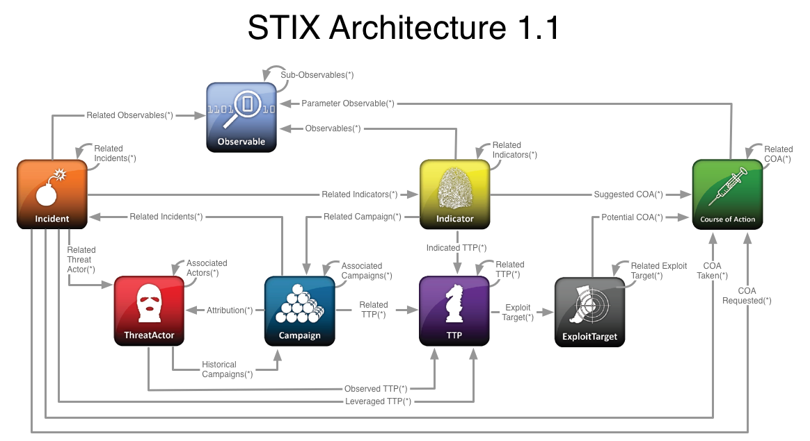
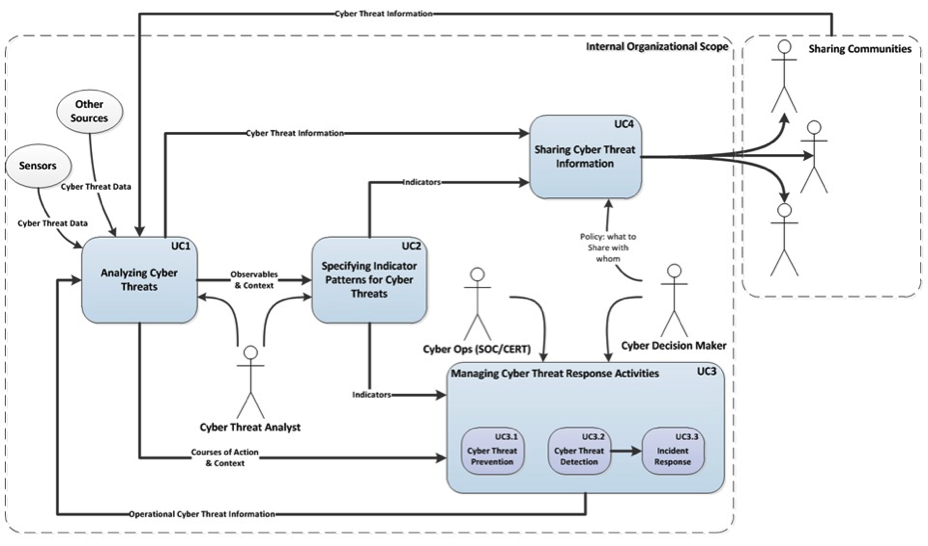

.. _justifications:

Justification for and nature of changes
=======================================

PRISEM is the first regional government collaboration in the United States to
enter into a Cooperative Research and Development Agreement (CRADA) with
US-CERT to receive de-classified IOCs. The intent is to receive and send these
indicators using MITRE Corporation’s Structured Threat Information eXpression
(STIX) format. The goal is to eventually link the IOCs with
Tools/Tactics/Procedures (TTPs) and Courses of Action (CoA) to provide
actionable intelligence to PRISEM members (see Figure :ref:`stixrelationships`
-- original source: Bret Jordan, Blue Coat Systems).

.. _stixrelationships:

   Relationship between STIX Elements

..

.. _changejustification:

Justification for change
------------------------

Knowledge is becoming a critical success factor for organizational performance.
Many public and private organizations are sharing knowledge as one of the means
to collaborate and gain sustainable competitive advantage over these threats.
Advances made in information and communication technology (ICT) is aiding these
efforts. The need for infrastructure protection and real-time to near-real-time
automated response to cyber threats to enable expedient top-level decisions has
become imperative. However, a widely accepted framework for visualization,
analytics, situational awareness, enabling intraregional response to shared
threats does not exist today.

To address these concerns, a system called the Distributed Incident Management
System (DIMS) will be built. DIMS will be based mostly on existing technology,
much of it from the open source software development community, and leveraging
emerging standards. The primary users of DIMS are the Computer Security
Incident Response Teams (CSIRTs) who need to maintain the security and
functionality of a diverse and complicated, yet institutionally critical cyber
infrastructure. DIMS will be based on open source technology and standards.

.. _changedescription:

Description of needed changes
-----------------------------

.. todo::

   This paragraph shall summarize new or modified capabilities/functions,
   processes, interfaces, or other changes needed to respond to the factors
   identified in :ref:`changejustification`.

..

As mentioned in the previous section, MITRE has been working with US-CERT to
develop standards that enable the kind of response and recovery process called
for by EO 13636 and PPD 21. To that end, they have illustrated how STIX can be
applied to four specific use cases that bridge local to national response.
These use cases (shown in Figure :ref:`stixusecases`, taken from the STIX web
site) are: *Analyzing Cyber Threats* (UC1); *Specifying Indicator Patterns for
Cyber Threats* (UC2); *Managing Cyber Threat Response Activities* (UC3); and
*Sharing Cyber Threat Information* (UC4). [The12]_

.. _stixusecases:

   STIX uses cases (from MITRE)

..

MITRE defines *observable* as, "[an] event or stateful property that is observed
or may be observed in the operational cyber domain, such as a registry key
value, an IP address, deletion of a file, or the receipt of an http GET. STIX
uses Cyber Observable eXpression (CybOX) to represent Observables."  The
PRISEM system collects logs that contain the IP addresses of the source and
destination of events and flows, along with other information about specific
security events (sometimes including domain names, URLs, services being used,
and observed attack signatures).

MITRE defines *indicator* as, "[a] pattern of relevant observable adversary
activity in the operational cyber domain along with contextual information
regarding its interpretation (e.g., this domain has been compromised, this
email is spoofed, this [:term:`cryptographic hash` of a file] is associated with this trojan, etc.),
handling, etc. An Observable pattern captures what may be seen; the Indicator
enumerates why this is Observable pattern is of interest." (`STIX FAQ #B1`_)
One job of an analyst using the PRISEM system is to take *indicators* that are
shared by outside sources, which are used to trigger alerts within the PRISEM
system, and connect them with those logs that include related observables and
other context (such as the information stored in the Collective Intelligence
Framework database) and distill them into analytic products like situational
Indicators of Compromise, or IOCs, can also be described as "a forensic
artifact or remnant of an intrusion that can be identified on a host or
network. [IOCs] tie to observables and observables tie to measurable events or
stateful properties which can represent anything from the creation of a
registry key on a host (measurable event) to the presence of a mutex (stateful
property)." [Gra12]_ IOCs can include several pieces of raw intelligence
that manifest at various points in time on information systems under attack,
including "MD5 [and other :term:`cryptographic hash` values for files], File
names, Packer types, Registry keys, Mutexes, DNS strings, and IP
Addresses." [Man11]_

IOCs are the lowest-level pieces of evidence used to paint a much larger
picture as part of the response and remediation process. [Ald12]_  They
are the needles to attempt to find in a haystack, not a request to go find
needles. Many of these indicators are found within the file system of a
compromised computer, while others can be found in network flows and server
logs that include transport and network layer information (e.g., IP addresses
and IP protocol and port numbers.)

A workflow or workflow process is the set of steps that someone goes through to
perform a complex task, such as fulfilling an order for an online purchase, or
performing forensic analysis of event logs and network flow data to confirm
compromise, determine root cause, and learn the extent of a breach. Microsoft
describes it this way: "Workflow is fundamentally about the organization of
work. It is a set of activities that coordinate people and/or software.
Communicating this organization to humans and automated processes is the
value-add that workflow provides to our solutions.  Workflows are fractal. This
means a workflow may consist of other workflows (each of which may consist of
aggregated services). The workflow model encourages reuse and agility, leading
to more flexible business processes." [Mic]_

In the case of the forensic analysis process that underlies response as
described above, the workflow is fractal in terms of including other workflows,
but is also a recursive process. This process can start with one or more IP
addresses or network address blocks that are suspicious.  This can lead to a
set of potentially compromised computers who had communication to that single
IP address.  Looking at the flows to/from those suspect computers results in a
larger set of potentially malicious computers that are related to the first IP
address, but were not known at the start. The developing network of malicious
activity grows with each iteration in the discovery process and each new search
result builds on previous knowledge.  As the network increases in size, the
analyst wants to filter out known good hosts, and highlight the known bad
hosts, in order to find new suspect hosts to evaluate (and then hopefully move
to the known good or known bad sets.) Keeping track of the growing body of
known good and known bad is a requirement of the workflow for this discovery
process.

The objective of the DIMS system is to support the following high-level
missions and needs, which incorporate the four use cases described above as
defined by MITRE:

#. To facilitate collaborative response to shared threats by supporting
   real-time and near real-time communications, situational awareness in
   graphical and text report formats, and role-based controlled access to
   security event and alert data housed in a shared SIEM system. (UC1 and UC3)

#. To provide a framework for visualization and analytic tools that result in a
   shared view of common threats, in a manner that compares and contrasts each
   participant with others in the system to help them understand whether
   certain threats are widespread and common, or may be targeted to a specific
   sector, organization, or physical locality. (UC3)

#. To facilitate the real-time and near real-time operational sharing of
   actionable information in the form of structured IOCs and Observables that
   support triage, response and recovery, and determinations of events of such
   criticality that they require reporting to federal authorities. These IOCs
   and observables may come from US-CERT (as part of the CRADA between US-CERT
   and the PRISEM project), may come from other trust groups (be they
   sector-specific, regional, or self-organized), or may come from federal law
   enforcement agents in the local field office. As IOCs and Observables are
   linked with TTPs and COAs (see Figure :ref:`ioccoalinks`
   for an example of the minimial linkages necessary to operationalize IOC and
   Observable sharing), the users can more quickly and efficiently respond and
   recover. (UC2, UC3, and UC4)

   .. _ioccoalinks:
    
   .. figure:: images/STIX-Diagram-1-1-DIMS-w-bg.png
      :alt: Minimal linkage from Observables to COA
      :width: 95%
      :align: center
    
      Linking minimal subset of STIX elements from Observables to COA
    
   ..

#. To facilitate tracking of remediation efforts across participants. It is a
   common occurrence to receive a report with a list of IP addresses and/or
   domain names of suspected compromised or abused hosts. Having a mechanism to
   automatically determine which IP addresses are of interest to which
   participants by comparing those addresses to assigned network blocks or top
   level domains makes it easier to know when attention should be paid to data
   coming in to the system. Similarly, after remediation it is possible to
   toggle the status of these hosts and automatically keep track of when a site
   has completed cleanup, what percentage of known compromised hosts have yet
   to be mitigated, and how quickly they are being cleaned up. This information
   speeds up overall response and provides metrics by which to compare process
   improvements over time. (UC1 and UC3)

#. While not directly mapping to one of MITRE’s use cases, the DIMS effort is
   intended to enable integration of complementary open source security tools
   and put these tools back into the community as open source tools, and/or
   transition these tools into commercially available products that advance the
   state of the art in distributed incident response.

.. _opstrustportalchanges:

Ops-Trust portal Code Base
~~~~~~~~~~~~~~~~~~~~~~~~~~

The principle mechanism lacking from the Ops-Trust portal is the ability to
pre-process IOC data sent by users so as to notify each user when a thread
pertains to them (because IOCs match pre-defined lists that the user cares
about), and more specifically, which email messages contain IOCs of interest.
The data necessary to do such filtering and altering is not stored in the
Ops-Trust portal database, nor is there a standardized mechanism for passing
machine-parseable data into the portal to facilitate workflow automation. The
Ops-Trust portal is also monolithic and focused on managing the trust groups
and users, not on making data analytics and visualization capabilities
available to help process the IOC data that is available throughout the user
base. It does not have capabilities to anonymize data, nor to associated TLP
tags with data such that filtering and anonymization does not rely solely on
humans knowing when/how to filter and anonymize data, and on them never making
mistakes.

.. How does it need to change?

The Ops-Trust portal, written in Perl with a PostgreSQL database backend, needs
to be refactored, using a model-view-controller framework (MVC) framework such
as Catalyst (http://www.catalystframework.org/), to separate the front end UI
capabilities from the back-end database and portal workflow processes so as to
provide an API that alternate UI components can access via a standardized
mechanism such as a RESTful HTTPS interface. The UI needs to be refactored to
improve usability and provide access to both user and administrator functions.
It needs to have additional user attributes added to facilitate the filtering
and notification process described above, as well as to have workflow
processing features added to perform some of the manual filtering and searching
capabilities. The account management features need to be extended to support
AAA and RBAC features that use mechanisms such as roles and TLP tagging to
ensure exported data is filtered and/or anonymized in accordance with
user-defined policies. Once the MVC conversion has been completed, and some of
the additional attributes and features necessary to semi-automate information
sharing, an application penetration test needs to be performed to satisfy
requirements of the authors for publicly releasing the code as an open source
project.

.. Why is this relevant?

Adding features to enable trusted sharing of machine-parseable IOCs between
instances of the Ops-Trust portal makes it possible to scale trusted
information sharing to a larger population than the existing Ops-Trust group is
capable of growing. Having additional attributes for users enables workflow
automation of notification of IOCs relevant to their constituencies, which
speeds response. Eventually, features that ensure the chain-of-custody and
provenance of security data that can be used as evidence in criminal or civil
legal proceedings, combined with the machine-parseable nature of the data
exchange, will facilitate reporting computer crimes to law enforcement in a
manner that speeds their investigations and helps more accurately scope and
prioritize investigations.

.. _cifchanges:

Collective Intelligence Framework (CIF) Database
~~~~~~~~~~~~~~~~~~~~~~~~~~~~~~~~~~~~~~~~~~~~~~~~

..  How does it need to change?

It is unknown how much data can be put into CIF before it reaches performance
or storage limits. As part of the PRISEM deployment of CIF, mechanisms were put
in place to regularly log the sizes of certain database tables and the database
itself, and to log the amount of time it takes to pull feeds from outside
sources, to perform correlation, and to index database tables (all processes
that run from :term:`cron` on a scheduled basis). This information has only been used
to answer questions at given points in time, but the intention was to perform
linear regression on this data on a regular basis to estimate when resource
limitations will be hit (e.g., when the disk drive is expected to be filled to
100%, or when the CPU processing capacity approaches 100% on a continual
basis.) This would allow better monitoring of resources, tuning of system
parameters, and estimation of hardware capacity required as the PRISEM
population increases. All of these features would be made available to the CIF
developers to extend the capability of all CIF users to be pro-active about
their deployment infrastructure.

.. Why is this relevant?

As CIF is a "work in progress" and constantly undergoing development, the
community of users is often called upon to help identify bug fixes and feature
additions that can be made available to the CIF development team via :term:`Git` "pull"
requests. This helps improve the generally available release of CIF and
minimizes the need to maintain add-on patches independent of CIF releases.
Since the intention of DIMS is to be replicated in many regions, each of which
constitutes a different mix of participants, security data sources feeding the
central SIEM, etc., mechanisms to better identify capacity requirements and
monitor runtime resource usage for minimum downtown becomes critical. The same
machine learning algorithms used for resource monitoring are also useful for
clustering and classification of security event data, so their implementation
in a generalized framework increases the flexibility of their application.

.. _prisemchanges:

The PRISEM System
~~~~~~~~~~~~~~~~~

.. How does it need to change?

The underlying inter-process communication added to the PRISEM system in recent
months provides a flexible and extensible mechanisms for Remote Procedure Call
(RPC) invocation, as well as logging of information about queries and response
times that can serve to estimate wait times for longer queries. This message
bus architecture is also programming language agnostic, operating system
agnostic, and is using a structured command structure that allows
self-description of the data being sent between programs to facilitate merging
results from multiple processes (e.g., the “identify friend or foe” capability,
anonymization and statistics, partitioning and filtering based on participant
network allocation attributes, etc.) A new user interface that supports all of
these capabilities in a flexible framework architecture will allow seamless
integration between any SIEM product, any vendor portal, and any open source
security tools that are appropriate for processing the kind of data held within
PRISEM.

.. Why is this relevant?

Adding a layer of abstraction above the SIEM and vendor portal allows
flexibility for any SIEM, or any managed security service vendor, to be
employed to build a PRISEM-like regional collaborative group. There are many
competitors in this field, and none of them combines the features of universal
compatibility, affordability across the full range of small to large SLTT
collaborative groups, and ease of migration or interoperability as regional
collaborative groups spontaneously form and grow. What do you do if two groups
using two different SIEM products and two different vendor portals wish to
merge? What do you do if the SIEM you are using reaches its end-of-life and is
now longer supported, necessitating a migration of over a year’s worth of
normalized log data to be translated to a new product? What do you do if a
group decides they want to replicate the PRISEM model, and now has to scope out
a SIEM deployment and/or managed security service vendor contract for
provisioning and support? These are all realistic questions, very hard to
answer in the short term, very costly to enter in to, and take a significant
effort to reach a go/no-go decision point. An abstraction layer that focuses on
standardized data interchange, vendor-agnostic interfaces to data, and an open
framework for new features, solves many of these problems and provides the
affordability, flexibility, and scalability that is needed to reach national
scope.

Summary of the capabilities gap
~~~~~~~~~~~~~~~~~~~~~~~~~~~~~~~

The principal high-level gaps that exist in supporting the missions described
in the previous section have to do with the availability and affordability of
tools that support those missions. Each of these tools have limitations or
impediments to their use:

+ There are managed security services that could be engaged to handle all
  security incident response and forensics. The cost of these services is
  prohibitive for all but the most serious incidents with potential losses that
  rise to the level of existential threats to the viability of the enterprise.
  The availability of affordable open source tools to improve response and
  recovery is a gap that DIMS is intended to fill.

+ There are agent-based systems and network-based that can provide the level of
  detail and pervasive collection of event data at the host, server, and
  network levels. These, too, are prohibitively expensive. They only work in
  environments where policy can dictate the deployment of agents on all end
  hosts and servers, and where network topology and administrative
  responsibility at the enterprise level is such that one group can deploy,
  manage, and interact on a daily basis with the security system. Most SLTT
  government sites cannot afford to have this level of in-house security
  monitoring and response capacity. At present, even if one site in a region
  can afford such capabilities, their use is limited to protection of that site
  alone and there is little benefit to other inter-related entities in the
  region (hence the need to share not only IOCs and Observables, but also
  Course of Action and analytic results.)

+ Most SIEM systems focus on the problem of collecting and correlating millions
  of events per day, distilling them down to a reasonable (N<=100/day) level,
  and directing them to the entities with administrative control over the
  system identified in the alerts. Correlation across a confederated population
  is not typically done (most deployments are for one enterprise, perhaps with
  multiple business units under the same top level corporate structure). These
  systems are also primarily focused on detection and alerting on input of
  events, not on after-the-fact triage and respond/recover operations. When
  they do support forensic analysis of past events, these systems typically do
  not support confederated cross-organizational correlation and collaborative
  response (e.g., by sharing analysis between multiple enterprises, or
  distributing Course of Action information.)

+ The existence of the Ops-Trust community proves that volunteers can
  self-assemble to respond and react to issues that impact everyone on the
  internet, but these groups frequently operate on email and chat communication
  channels that are unstructured, ad-hoc, and are very difficult to keep up
  with. Unless one reads every message in every email thread, extracts all
  attached files or processes all in-line data, and manually searches for IOCs
  and Observables that can be manually used to search data sources that that
  person controls, the benefit of information sharing is lost. And for any
  emergent situation of global significance, the threads are many and the
  messages in each thread can flow for days or weeks. It is impossible to keep
  up with this without moving to structured data and machine processing to
  identify messages of interest. 

+ There have been many formats for structured security data sharing developed
  over the years. Each one has seen a similar lifecycle, where there is
  interest and excitement at the start of the project, a slow deliberative
  process of developing the standard, going through the process of vetting and
  acceptance of the standard by an official body, and then a push to get the
  industry and researchers to adopt the standard. STIX may encounter this same
  fate. It is too early to tell. What some (like Wes Young, developer of the
  Collective Intelligence Framework) suggest as an alternative is to "blow up
  the standards process" and simply implement something quickly, get it used
  by as many people as possible, adapt and modify it to address limitations
  that are encountered, and keep moving forward. "We believe traditional
  standards processes not only have a high barrier to entry, but are often slow
  and use the design by committee approach. We believe the best way to create a
  protocol is from the ground up using CONOPs. Push design out to the edge and
  let operations influence design in real-time."
  (`CSIRT Gadgets Foundation`_ web site)

.. _changepriorities:

Priorities among the changes
----------------------------

.. todo::

   This paragraph shall identify priorities among the needed changes. It shall,
   for example, identify each change as essential, desirable, or optional, and
   prioritize the desirable and optional changes.

..

Changes considered but not included
-----------------------------------

.. todo::

   This paragraph shall identify changes considered but not included in
   :ref:`changedescription`, and rationale for not including them.

..

Assumptions and constraints
---------------------------

.. todo::

   This paragraph shall identify any assumptions and constraints applicable to
   the changes identified in this section.

..

.. _STIX FAQ #B1: http://stix.mitre.org/about/faqs.html#B1
.. _STIX FAQ #B2: http://stix.mitre.org/about/faqs.html#B2
.. _CSIRT Gadgets Foundation: http://csirtgadgets.org/rfc/getting-started/

.. [The12] The Mitre Corporation. Standarizing Cyber Threat Intelligence Information with the Structured Threat Information eXpression (STIX). http://makingsecuritymeasurable.mitre.org/docs/STIX-Whitepaper.pdf, 2012.
.. [Gra12] Will Gragido. Understanding Indicators of Compromise (IOC) Part I. http://blogs.rsa.com/will-gragido/understanding-indicators-of-compromise-ioc-part-i/, October 2012.
.. [Man11] Mandiant. Using Indicators of Compromise to Find Evil and Fight Crime. http://www.us-cert.gov/GFIRST/presentations/2011/Using_Indicators_of_Compromise.pdf, August 2011.
.. [Ald12] Jim Aldridge. Targeted Intrusion Remediation: Lessons from the Front Lines. https://www.mandiant.com/blog/black-hat-usa-2012-presentation-targeted-intrusion-remediation-lessons-front-lines/, August 2012. Black Hat USA 2012 Presentation.
.. [Mic] Microsoft Developer Network. Chapter 3: Workflow and Process. http://msdn.microsoft.com/en-us/library/bb833024.aspx.
