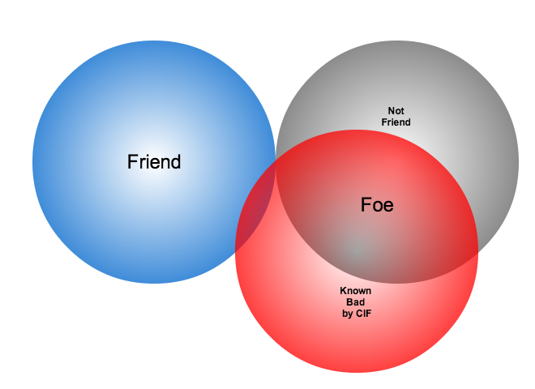

.. _operationalscenarios:

Operational scenarios
=====================

.. todo::

   This section shall describe one or more operational scenarios that
   illustrate the role of the new or modified system, its interaction with
   users, its interface to other systems, and all states or modes identified
   for the system. The scenarios shall include events, actions, stimuli,
   information, interactions, etc., as applicable.  Reference may be made to
   other media, such as videos, to provide part or all of this information.

..

A common scenario occurring regularly today involves responding to what are
known commonly as `botnets`, or distributed intruder attack networks constructed
of computers infected with malicious software (or `malware`). A botnet is the
name given to a set of stolen computer assets that form a distributed computer
attack network capable of performing many functions for a computer criminal.
These functions can include any/all of the following: Distributed Denial of
Service (DDoS) attacks of various types; scanning for vulnerable hosts to
infect to grow the botnet; searching computers for sensitive information (e.g.,
email addresses, credit card or banking information, login accounts and
passwords, files containing proprietary data that are to be exfiltrated;
sending spam emails; etc. This is typically accomplished by first compromising
a number of computers using one of several direct or indirect methods of
propagation, resulting in installation of malicious software followed by
outbound (or inbound) connections to achieve command and control (C&C) of the
infected hosts, or `bots`.

The role of SIEM in this context is to provide `correlation` of multiple
events, not just to trigger alerts based on single detected events. The Botnets
system used within the PRISEM project produces reports that summarize
individual discrete events, which by themselves may be `false-positives`. Even
when a score is high because of multiple alerts being generated for repeated
activity, the alert may be meaningless. Or someone may have entered an
indicator into the database with low confidence of suspicious activity, which
made its way into a `watchlist` detector that begins to trigger events when
connections are seen to the watchlisted IP address. Requiring that multiple
different alerts occur simultaneously (e.g., scanning, attempted SMTP
connections, and suspected botnet command and control) before the events become
elevated to `alerts` has the effect of increasing the probability that the host
involved is truly compromised (i.e., a true-positive alert). The analyst
looking at alerts and reports must be careful to know `what the alert means`,
`how it was derived`, `what its confidence level is`, and `whether it is a
valid alert or not` before passing it along, or to at least reflect a low
confidence or otherwise include a caveat statement unless and until other
correlating data substantiates malicious activity.

.. _analysisscenario:

Generalized Analysis Scenario
~~~~~~~~~~~~~~~~~~~~~~~~~~~~~

Using PRISEM components to walk through some of the steps in responding to a
suspected botnet related event helps illustrate the process:

#. The analyst may start with a message that provides indicators of compromise.
   Figure :ref:`emailwithindicator` shows a message reporting a suspected
   network involved in known SSH dictionary scanning, attempting to gain access
   to insecure accounts.

   .. _emailwithindicator:

   .. figure:: images/email-with-indicator.png
      :alt: Email with indicator of SSH scanning activity
      :width: 80%
      :align: center

      Email with indicator of SSH scanning activity

   ..

#. The analyst can look in CIF to find what is known about this netblock. From
   public sources, this network block has been known for a while to be involved
   in SSH password-guessing attempts. (Figure :ref:`cifoutput` only shows the
   first few fields from the CIF database.)

   .. _cifoutput:

   .. figure:: images/CIF-SSH-scanner-lookup.png
      :alt: CIF lookup results
      :width: 90%
      :align: center

      CIF lookup results for scanning CIDR block

   ..

#. The analyst can search historic network flow records to see if there were
   any recent flows to/from the reported suspect CIDR block. In this case, a
   seven-day search does turn up some flows. The output in Figure
   :ref:`rwfindoutput` shows both raw output form and anonymized output
   using the methods described earlier:

   .. _rwfindoutput:

   .. figure:: images/identified-flows.png
      :alt: Confirmation of network flows
      :width: 90%
      :align: center

      Confirmation of network flows related to suspect CIDR block

   ..

   .. todo::

      Cross-reference the anonymization section where it says, "described earlier."

   ..

#. The analyst may then query CIF using the web browser interface to see if
   this specific IP address, seen in the identified flows from the previous
   step, has any information about it. Figure 7 confirms that it does
   (including showing a record of the search for the suspicious CIDR block from
   a previous step).

   .. _ciffulloutput:

   .. figure:: images/CIF-browser-full-query.png
      :alt: Output of full CIF query via browser plugin
      :width: 90%
      :align: center

      Output of full CIF query via browser plugin

   ..

#. The analyst can then search for the same information, this time using the
   PRISEM vendor portal. Figure :ref:`prisemportal` shows the report interface,
   where a search rule is entered for the IP address found in the network flow
   report. If the user wanted to search for the entire CIDR block, they would
   have to enter 256 search terms for each IP address in this interface, since
   it was not designed to process CIDR blocks (just look for individual IP
   addresses, or simple substrings thereof).

   .. _prisemportal:

   .. figure:: images/PRISEM-portal.png
      :alt: PRISEM portal log query
      :width: 90%
      :align: center

      PRISEM portal log query

   ..

#. The search results can be saved to a comma-separated value (CSV) file for
   further manual processing.

   .. _portaloutput:

   .. figure:: images/PRISEM-portal-output.png
      :alt: PRISEM portal CSV output
      :width: 75%
      :align: center

      PRISEM portal CSV output

   ..

At the end of these steps, the analyst knows more about whether any PRISEM
participants had any interaction with these suspect hosts, but these interim
results are not integrated into a single report, the contextual knowledge
embodied in one part of the system is not carried over into output of another
part, and there is no qualification of the events that were identified. Were
these scanning attempts blocked (meaning low relevance for response) or were
there actual flows that would lead to a conclusion of compromise of any assets
(meaning high relevance for response)?

If the steps in the workflow process are too numerous, too manually intensive,
and too cumbersome, an analyst is slowed down and rendered less effective or
limited in their ability to adequately respond. They may waste time, or may not
complete the task, allowing attackers to slip past. If the user must log in to
a portal and initiate the process by cutting/pasting individual IP addresses,
and pointing/clicking on a `Run!` button, the process will only happen when the
human is there to initiate it. Automating these tedious and repetitive tasks,
and scheduling some common tasks to be run automatically so the results are
waiting to be viewed, frees up the analyst to focus on the hard problems that
require human intelligence. This is the only way to increase the velocity of
the defender closer to that of the attacker as described by Col. John Boyd in
his `OODA Loop` -- Observe, Orient, Decide, and Act -- construct.  (Boyd, 2008;
Richards, 2009)

.. todo::

   Add citation to Boyd 2008, Richard 2009.

..

In the following subsections, we will look at some common workflow processes in
an operational context.

There are three primary use cases of workflows that the DIMS system must serve:

#. Processing of indicators of compromise sent into the system in a
   semi-automated manner;

#. Processing of indicators of compromise entered manually in response to
   external activities (e.g., collaboration in closed, vetted, trust
   communities, from information passed along from law enforcement, etc.), and;

#. As discovered in the iterative and recursive steps taken by an analyst as
   part of the network forensic process. These use cases parallel those
   illustrated by MITRE on their STIX web site as UC1, UC3, and UC4.  (MITRE
   2013) Each of these use cases will be described as a separate Mission
   Operations Scenario.

.. todo::

   Add cross-reference to STIX use case subsection and citation for MITRE 2013.

..

.. _automatediocsharing:

Automated IOC sharing
^^^^^^^^^^^^^^^^^^^^^

Automated sharing of IOCs is not as simple as someone sending an IOC file,
which is implicitly acted upon as if it were a request to go search events for
some previous period of time and immediately return a report. A human being
must validate the results for accuracy and adherence to information sharing
policies, approve of the result, and manually release the file to outside
parties (possibly after redacting some of the information in the report). This
means that even if the first task of performing a historic search is fully
automatic, there must be a mechanism for alerting someone that the report is
ready for review, multiple automated and asynchronous query results must be
queued until they have all been processed, and specific reports must be chosen,
analyzed, and released at the appropriate time to the appropriate parties.

There are actually two sub-use cases for automated IOC sharing (one an
external-to-internal sharing followed by a reciprocal return
internal-to-external sharing, and the other an internal-to-external sharing).
Both have privacy sensitivities that require anonymization and controlled
release of information.  The first is the situation where US-CERT will be
sending de-classified IOCs to the PRISEM system in the form of STIX files
(Mitre, 2012), to determine if known malicious activity seen at the federal
level is also being seen at the SLTT government level. This is automated input
and manual (i.e., vetted and approved) output going back up to the federal
level. (Other organizations, such as Microsoft's MAPP program, are similarly
being established to share IOCs using STIX (Bluehat1, 2013), so STIX packages
will become a general input mechanism. An example [abbreviated] STIX file that
holds IP addresses and CIDR blocks extracted from a CIF database for use as a
`watchlist` is shown in Figure 10.)

.. todo::

   Add citations MITRE 2012, Bluehat 2013, and fix Figure cross-reference.

..

.. _stixwatchlist:

.. figure:: images/STIX-watchlist.png
   :alt: Example watchlist in STIX format
   :width: 90%
   :align: center

   Example watchlist in STIX format

..

.. todo::

   Get a more recent example from Stuart.

..

The second is automated determination of the `sources` of confirmed malicious
activity seen at the SLTT level that is collected on a daily basis and prepared
for sharing with federal law enforcement and counter-intelligence agents to
determine if known cases being investigated by federal agencies involve parties
locally.  The targets of the attacks (i.e., the sources of the IOCs within the
PRISEM participant base) are `not shared`, but only data about the outside
`malicious sources`. If federal agents determine that there is a match with an
open investigation, they will discretely reach out to a designated contact
within the PRISEM system who can assist in reaching out to establish
connections with the source (should they chose to make such a connection.)

.. todo::

   Talk to Anderson Nascimento about getting a sentence or two about
   the encrypted set comparison idea we have been talking about.

..

.. _manualentryofiocs:

Manual entry of IOCs
^^^^^^^^^^^^^^^^^^^^

The second case is similar to the external-to-internal sharing use case just
described. An analyst or research affiliated with the PRISEM project who may be
part of a closed, vetted, trust community, may come to possess information
about known or suspected malicious activity derived from investigations
performed by another member of said community. That information may be highly
sensitive, but also may be highly indicative of targeted activity that has
previously escaped the view of the information security vendor and researcher
communities, which means it may have bypassed `any and all detective mechanisms`
and never triggered an alert within PRISEM's SIEM system (i.e., it is a `false
negative`). The analyst would enter data, perhaps in the same way as with the
US-CERT IOCs, but processed separately and not queued for potential release to
US-CERT. If this check determines there is no evidence of activity within the
PRISEM data pool, the analyst is notified. The analyst may optionally chose to
enter these indicators into a `watchlist` to alert if/when those indicators are
seen in the future (with a note as to why they were put there in the first
place, what the suspected activity involved, etc.) This contextual data is best
kept in CIF, where it can be correlated with other activity reported by the
community in the future.  If, on the other hand, there is confirmation that
PRISEM participants have been involved in the same activity, the analyst has
just performed the first iteration of the next use-case we will consider.

.. _networkforensicanalysis:

Network Forensic Analysis
^^^^^^^^^^^^^^^^^^^^^^^^^

.. _indicatorlifecycle:

   Indicator Lifecycle

..

The final use case is the most complex, as it involves a series of iterative
and recursive queries of available data, going back and forth through time, and
extending outward from an initial point to build a network of known hosts
involved in various phases (see Figure :ref:`indicatorlifecycle`) of what is
known as the `cyber kill chain` (Hutchins et al, 2011).

.. todo::

   Add citation to Hutchins 2011.

..

The steps described in Section :ref:`analysisscenario` and the previous two
workflows are repeated, following the process shown in
:ref:`indicatorlifecycle`. The discovery and analytic process can refine the
understanding of when response actions must be taken, however the deeper an
analyst goes using this cycle, the larger the number of discrete files are
created in the form of intermediary results and simple output reports.  The
task of the analyst gets harder and harder to perform as they are buried in
related, but unlinked, raw data. This makes it crucial that machine-parseable
data be used as both input and output for the steps within each workflow, using
a pipeline methodology to take the results of one process and use it in the
next step of the process, as well as to attenuate the volume of raw data by
applying selective filters to reduce the noise. This is not possible with
primitive forms-based browser interfaces that are not designed to maintain and
use state (e.g., knowledge gained by the analyst in previous steps) between
invocations.

This capability is illustrated in Mission Support Scenarios.

.. todo::

   Update the last sentence to refer to the right section.

..

We will now look at some other general Mission Support Scenarios that focus on
improving the efficiency of daily communications workflow processes.

.. _trackingremediation:

Tracking Status of Remediation Efforts
~~~~~~~~~~~~~~~~~~~~~~~~~~~~~~~~~~~~~~

A regular occurrence within the Ops-Trust community is someone reporting a
large number of hosts or network autonomous system (AS) numbers that have
vulnerable, exploited, or infected computers. The Subject line usually reflects
something about the data (e.g., *1.2M NTP amplifiers identified*) Members of
the list will read these email messages, extract the list from the body of the
message or attached files, process the list (often with a custom script), and
do what they can to mitigate the threat within their own network. Some will
respond to the email with something like "ACK for AS123, AS456, and AS678".

While these acknowledgement messages are nice, nobody is responsible for
tracking them, updating a list with status, etc. It is impossible for one to
know, without themselves tracking the entire thread and accumulating the
results from all responses, what percentage of the original list of 1.2M items
has been mitigated, which ones are left, etc. Such lists are sometimes sent in
the body of the message in what is known as a `Cymrufied list` (columns of IP
addresses, AS numbers, etc, separated by vertical bar ``|`` characters, made
popular by Team Cymru. (See Figure :ref:`cymrufiedlist`). Sometimes they are
Excel spreadsheets attached to the message, or Comma Separated Value (CSV)
files. Sometimes people just put a CIDR block in the Subject line of a message.
The method is ad-hoc, random, and often requires writing custom scripts to
process and extract just the data relevant to one’s own network. It is not
uncommon to receive a `Cymrufied list` that is placed in a GZIP compressed
Unix/Linux ``tar`` archive file, which is then attached to an email message
(necessitating extraction, unpacking the archive, processing the included file
with a script, then deleting the ``.tar.gz`` file, all `manually`.) 

.. _cymrufiedlist:

   Example "Cymrufied list"

..

The DIMS system will automate this process by supporting the automatic
recognition and processing of structured data files either uploaded into the
system, attached to email messages, or sent over TAXII or an AMQP message bus.
These structured files can then be processed and the context used to track
activity (i.e., is this the initial report, an acknowledgement that certain
items have been mitigated, etc.) This also allows tracking of the status of
mitigation, statistics over time, etc.

.. _identifyfriendorfoe:

Situational Awareness Through "Identifying Friend or Foe"
~~~~~~~~~~~~~~~~~~~~~~~~~~~~~~~~~~~~~~~~~~~~~~~~~~~~~~~~~

When trying to analyze events and alerts in a haystack of data, one method of
extracting meaning from the data is to organize it according to facts that are
known about the entities that are identified in the haystack of data. A first
order of meaning can be derived from taking the end points of connections and
categorizing them according to which sets they belong to: known to be a PRISEM
participant (a.k.a., `friend`), or known to not be a PRISEM participant.

.. _netmapping:

   Participant identification mapping

..

Figure :ref:`netmapping` illustrates how organizational top-level domains
and/or CIDR blocks for a subset of PRISEM participants are mapped to their Site
ID strings and chosen anonymization strings (i.e., the label that participant
would like to use to mask their internal IP addresses and host names in reports
that are shared outside the trust group.) When events are logged, and those
logs are ingested into the PRISEM system, they are processed so as to associate
them with the site from which they came. Once in the historic log archives, an
analyst may search for a specific observable (e.g., `show me all connections
to/from a specific suspect IP address.`) 

.. todo::

   Update the mapping figure to remove Seattle Childrens. (They are no
   longer a PRISEM participant.)

..

Using this mapping of domains and CIDR blocks to participants, it is possible
to identify all records in search results that are associated with any of the
PRISEM participants, count how many discrete hosts within each participant site
were found, and produce cross-organizational correlation statistics that
describe the percentage breakdown of all identified records in the search
results. An example of what this process produces can be seen in Figure 14. In
this example, hosts from seven different PRISEM sites were found, with the
three most frequent results being in Seattle Childrens Hospital (70.65%),
Kitsap County (26.61%), and Port of Olympia (1.38%).

.. _matchingnotmatching:

   Venn diagram of matching/not-matching sets

..

Making only one pass over a set of data only allows us to extract IP address
and domain names known to be in the map, or not in the map, deriving two
non-intersecting sets of entities that are either `matching` and `not
matching`. This is depicted graphically with the Venn diagram in Figure
:ref:`matchingnotmatching`.

Without any other information or context about the `not matching` entities that
were identified, there is not much that can be deduced about those entities,
other than they were involved in connections associated with whatever the
analyst was searching for. We can define the results of this pass as
identifying `friend` (because we are using a mapping of what constitutes
`friend` sites). This is, in fact, how the output of the Cross Correlation
service is tagged in Figure :ref:`crosscorriff`.

.. _crosscorriff:

   Cross-organizational Correlation of Query Results (Redacted)

..

Now that we have the list of entities that are not our `friends`, we can make a
second pass and add context that will be useful in helping make decisions.
Rather than just `known` and `not known,` we can determine, based on
information provided by selected authorities to have a certain level of
probability of being involved in malicious behavior, that an end point of
communication is believed to be hostile (a.k.a., `foe`). The Collective
Intelligence Framework accumulates reputation data from sources that the
security community deems to be trustworthy in determining which are malicious.
If an IP address or domain name occurs in a CIF feed of 65% confidence, then we
can assume with 65% confidence that any connections from a PRISEM participant
are highly suspicious indicators of malicious activity. If that IP address is
not known to any sources that feed CIF, it may or may not be malicious. It
could be associated with an `advanced persistent threat` actor who performs
targeted attacks and evades the security industry’s sandboxes. Or it could be a
totally innocent new social network site related to an animal rescue
organization. The context and search criteria used by the analyst to get the
data being processed holds some clues as to whether the connections are
innocent or malicious, and adding context regarding reputation from the
security industry and researchers assists even more in making a determination
of `innocent` or `malicious` activity.

.. _ifffromreputationdata:

   Identifying Friend or Foe Based on Reputation Data

..

Figure :ref:`ifffromreputationdata` illustrates how this second pass works.
Starting by identifying those entities that match a mapping of `Friend`, the
set of `Not Friend` can then be compared with the set of known malicious
entities stored in CIF. Those that are in the intersection of `Not Friend` and
`Known to be Bad` by virtue of being found in the CIF database are labeled
`Foe`, and the remainder are just `Unknown` at this point. (As an analyst
confirms they are actually `Foe`, they should be entered into CIF to allow a
positive identification of `Foe` in future queries. This is part of the
intelligence gathering process.)

.. _fullapt1graph:

   Graph of all APT1 Related Connections (180 Day Window)

..

The results of applying the outcome of identifying `Friend` and `Foe` to
network flows can be seen in Figure :ref:`fullapt1graph` (close-up views of
this large graph are found in subsequent figures) These are undirected graphs
of connections associated with the set of IOCs released by the FBI in Joint
Indicator Bulletin (JIB) #INC260425 in the wake of the release by Mandiant of
their `APT1 report` (Mandiant, 2013). Of the 632 IP addresses in the JIB list,
it was possible to identify over 7000 flow records associated with 106 hosts on
the City of Seattle’s network over the previous 180 days. All of those flows
were related to just 22 hosts out of the FBI’s list of 632. A search of event
logs archived in the PRISEM SIEM identified another three SLTT entities who
also had logged events corresponding with indicators on the FBI’s list. (In
this section, only the City of Seattle network flows are analyzed.)

.. todo::

   Add citation to Mandiant APT report.

..

.. _partialgraph1:

   Patial Graph of APT1 Connection End Points

..

The cluster in the bottom left of Figure :ref:`partialgraph1` shows three
`Friend` hosts (blue nodes labeled `CTYSEA_nn`) in communication with six
JIB-identified (APT1) hosts, only one of which was known by the security
industry and made it into the CIF database used by the PRISEM project.
Examination of the flows to/from these hosts shows them all to be DNS requests,
which is highly indicative of `Fast Flux DNS`  for evasion of detection during
malware infection. Figure :ref:`partialgraph2` shows a large number of `Friend`
hosts connecting to a known to be malicious APT1 host, while Figure
:ref:`partialgraph3` shows an even larger number connecting to an APT1 host
that had evaded detection by the security industry and researchers. The context
provided by CIF allows rapid triage of the first set, but the lack of known
reputation data points to the need to dig deeper and do more thorough analysis
of flows and/or perform host-level forensics on the second set of hosts to
determine the severity of compromise.

.. _partialgraph2:

   Connections to a Known Malicious Entity

..

.. _partialgraph3:

   Connections to an APT1 entity Unknown to CIF

..

This same process can be applied to textual reports, which could focus on each
of the discrete clusters in Figure :ref:`fullapt1graph`, including such
attributes as: country of origin for non-Friend nodes; AS of origin for
non-Friend nodes; Type of activity for `Foe` nodes as known to CIF (including
first seen, last seen, etc.); Characterization of identified flows and
identified log events (including ports, protocols, start time, duration, etc.).

